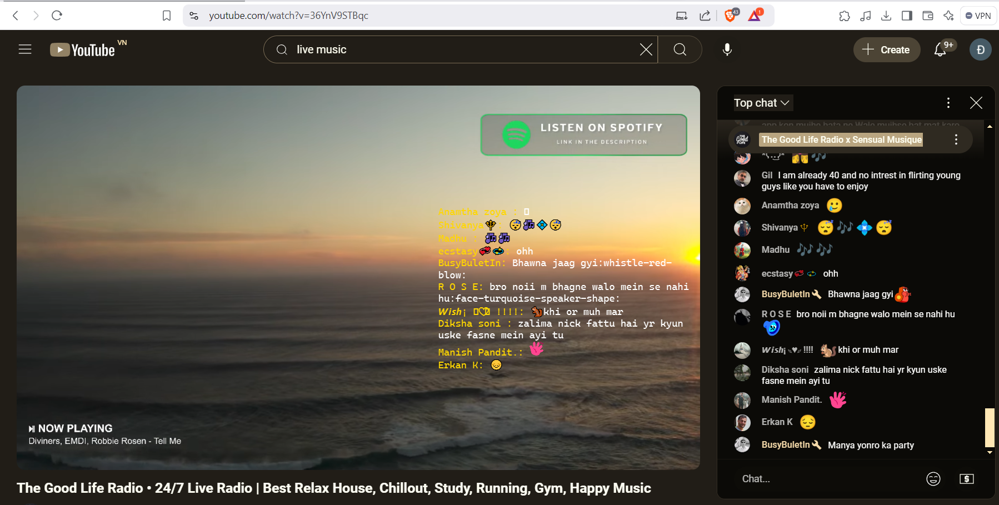

# YouTube Live Fetcher

This is a Python application designed to fetch and display live YouTube video chat on top of the screen in a window. The application is currently supported on **Windows 10 only**.

## Features

- Fetch live YouTube chat based on the YouTube video ID.
- Display live chat messages with support for emojis.
- A simple, easy-to-use interface with the help of **PySide6** for the window display.
- **Drag-to-move window support**, though it can be difficult to use.

  **Tip**: For easier window management, press `Windows + D` to go to the desktop, then click and select the chat window to drag and move it around.

## Requirements

The application relies on the following Python libraries:

- [pytchat](https://github.com/taizan-hokuto/pytchat) - A Python library to fetch live chat from YouTube live videos.
- [emoji](https://pypi.org/project/emoji/) - For displaying emojis in chat messages.
- [PySide6](https://pypi.org/project/PySide6/) - For creating the graphical interface (window) where the live chat is shown.

## Installation

To install the necessary dependencies, you can use `pip`:

```bash
pip install -r .\requirements.txt
```

## Usage

To start the application and fetch the live YouTube chat, run the following command:

```bash
python .\app.py <live_youtube_video_id>
```


## Demo

```bash
python .\app.py 36YnV9STBqc
```


## Contributing
If you want to contribute to this project, feel free to fork the repository and submit a pull request. Any contributions to improve functionality or compatibility are welcome!